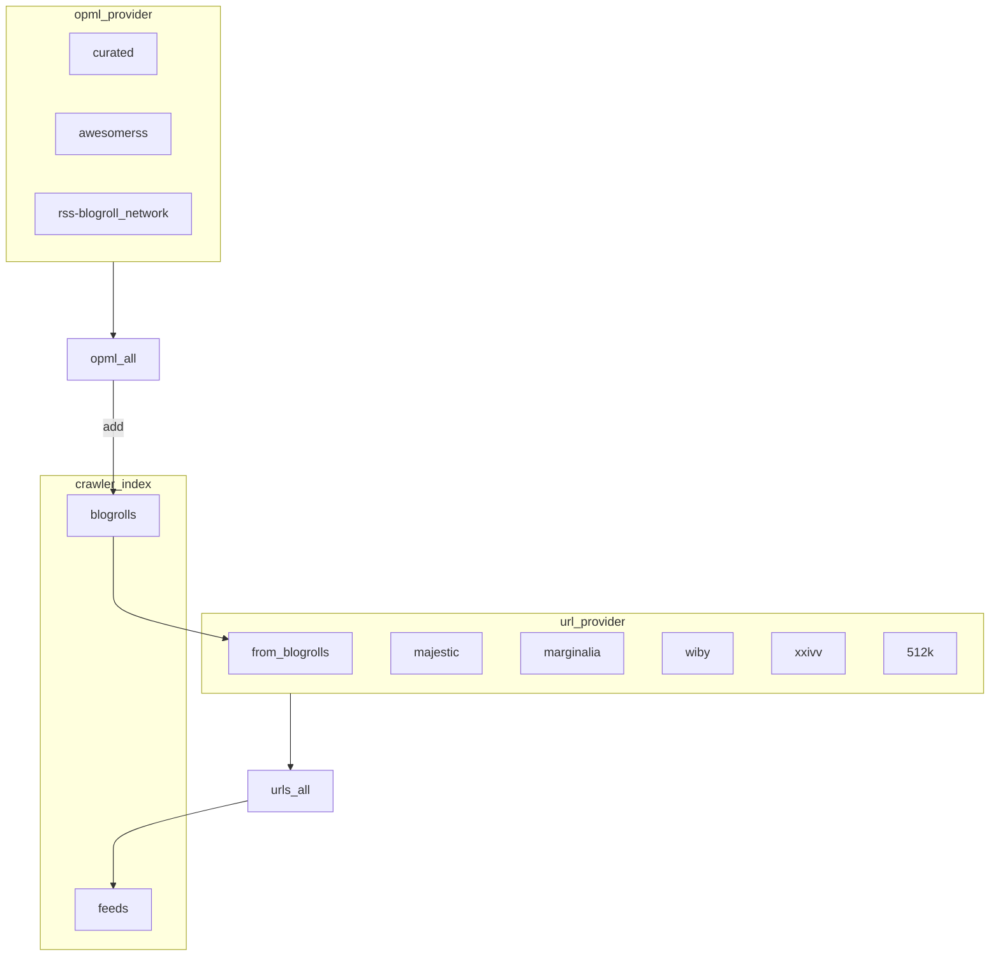

The datasets scripts are supposed to provide
- website URLs
- feed URLs
- OPML URLs

Scripts in this directory prefixed with `urls-` produce list of website/feed URLs to crawl, 
while scripts prefixed with `opml-` provide OPML URLs to parse as blogrolls. There is an
`*_all.sh` for both type which runs all scripts of each type at once.

## Provider data flow

